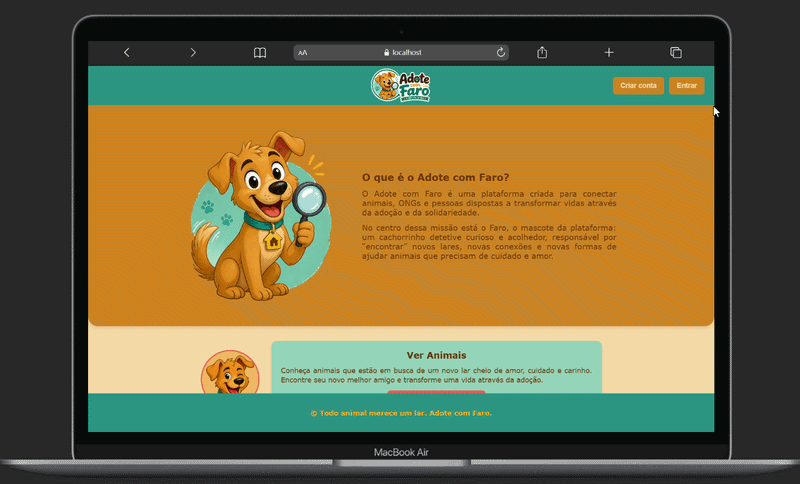
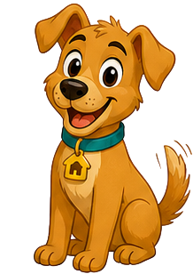

# 🐾 Adote com Faro


> Plataforma web desenvolvida para conectar animais resgatados a novos lares, facilitando o processo de adoção responsável.

---

## 📸 Prévia do Projeto

> **Adicione aqui um print ou GIF da aplicação**

<p align="center">
  
</p>

---

## 📖 Sobre o Projeto

O **Adote com Faro** é uma plataforma desenvolvida para aproximar ONGs, protetores independentes e pessoas interessadas em adotar animais.

A aplicação permite o cadastro e gerenciamento de animais disponíveis para adoção, oferecendo uma experiência intuitiva tanto para quem divulga quanto para quem procura um novo companheiro.

Este projeto foi desenvolvido com foco em boas práticas de desenvolvimento web, organização de código e experiência do usuário.

---
## 🐶 Conheça o Faro

<p align="center">
  
</p>

O **Faro** é o mascote oficial da plataforma e acompanha o usuário em diferentes partes da aplicação, tornando a experiência mais leve e acolhedora.

Seu design foi inspirado no **Scooby-Doo**, uma referência a um dos cães mais conhecidos da cultura pop. A inspiração busca transmitir simpatia, amizade e confiança — valores que refletem o propósito do projeto: incentivar a adoção responsável e aproximar animais de novos lares.

---
## ✨ Funcionalidades

### Visitantes
- Visualizar animais disponíveis para adoção;
- Pesquisar animais por nome;
- Filtrar animais por cidade;
- Visualizar detalhes de cada animal;
- Criar uma conta.

### Usuários autenticados
- Login e logout;
- Cadastro de animais;
- Edição de informações dos animais;
- Exclusão de anúncios;
- Gerenciamento dos próprios animais cadastrados;
- Upload de imagens.

---

## 🛠️ Tecnologias Utilizadas

### Front-end

- React
- Vite
- React Router
- CSS

### Back-end

- Node.js
- Express

### Banco de Dados

- MongoDB
- Mongoose

### Outras tecnologias

- JWT (Autenticação)
- Multer (Upload de imagens)
- bcrypt
- Axios

---

## 📁 Estrutura do Projeto

```text
Adote-com-Faro/
│
├── backend/
├── frontend/
├── README.md
└── ...
```

---

## 🚀 Como Executar o Projeto

### Clone o repositório

```bash
git clone https://github.com/seu-usuario/adote-com-faro.git
```

### Entre na pasta do projeto

```bash
cd adote-com-faro
```

### Backend

```bash
cd backend
npm install
npm run dev
```

### Frontend

```bash
cd frontend
npm install
npm run dev
```

---

## 🔒 Funcionalidades de Segurança

- Autenticação utilizando JWT;
- Senhas criptografadas com bcrypt;
- Rotas protegidas;
- Validação de dados no servidor;
- Upload seguro de imagens.

---

## 🎯 Objetivos do Projeto

- Incentivar a adoção responsável;
- Facilitar a divulgação de animais resgatados;
- Proporcionar uma plataforma intuitiva para ONGs e cuidadores independentes;
- Aplicar conhecimentos em desenvolvimento Full Stack.

---

## 📌 Melhorias Futuras

- Favoritar animais;
- Chat entre adotante e anunciante;
- Sistema de notificações;
- Geolocalização para busca por proximidade;
- Painel administrativo.

---

## 👩‍💻 Desenvolvido por

**Samires do Carmo dos Santos**

- LinkedIn: *(https://www.linkedin.com/in/samires-santos-b33067309)*
- GitHub: *(https://github.com/eusam04)*
